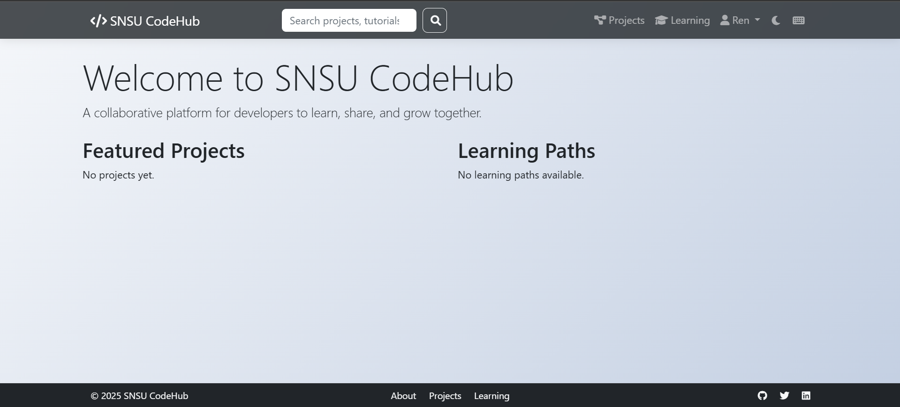

# SNSU_CodeHub
A collaborative platform for developers to learn, share, and grow together.

# SNSU CodeHub

SNSU CodeHub is a collaborative platform designed for developers, students, and coding enthusiasts from Surigao del Norte State University. The platform provides learning resources, project collaboration tools, and a community space for coding education.

## Features

- **Learning Resources**: Curated collection of tutorials, videos, and documentation
- **Project Collaboration**: Work on real projects with peers
- **Community Organizations**: Join department-specific groups (BSIT, BSCS, etc.)
- **Interactive Learning**: Follow structured learning paths
- **Dark Mode Support**: Enhanced UI with dark mode option
- **Responsive Design**: Works on all devices

## Setup

1. Clone the repository:
```bash
git clone https://github.com/mrfost07/SNSU_CodeHub.git
cd SNSU_CodeHub
```

2. Create and activate virtual environment:
```bash
python -m venv env
source env/bin/activate  # Linux/Mac
env\Scripts\activate     # Windows
```

3. Install dependencies:
```bash
pip install -r requirements.txt
```

4. Initialize the database:
```bash
   flask db init
   flask db migrate -m "initial migration"
   flask db upgrade
```

5. Run the development server:
```bash
flask run
```

## Homepage Preview


## Project Structure
```
SNSU_CodeHub/
├── app/
│   ├── auth/
│   │   ├── __init__.py
│   │   └── routes.py
│   ├── learning/
│   │   ├── __init__.py
│   │   └── routes.py
│   ├── main/
│   │   ├── __init__.py
│   │   └── routes.py
│   ├── organizations/
│   │   ├── __init__.py
│   │   └── routes.py
│   ├── projects/
│   │   ├── __init__.py
│   │   └── routes.py
│   ├── static/
│   │   ├── css/
│   │   │   └── style.css
│   │   ├── js/
│   │   │   └── main.js
│   │   └── public/
│   │       └── screenshots/
│   │           ├── homepage.png
│   │           └── structure.png
│   ├── templates/
│   │   ├── auth/
│   │   │   ├── login.html
│   │   │   └── register.html
│   │   ├── learning/
│   │   │   ├── add_resource.html
│   │   │   ├── index.html
│   │   │   ├── path.html
│   │   │   └── resources.html
│   │   ├── main/
│   │   │   ├── about.html
│   │   │   ├── dashboard.html
│   │   │   ├── index.html
│   │   │   ├── profile.html
│   │   │   └── search.html
│   │   ├── organizations/
│   │   │   ├── index.html
│   │   │   └── view.html
│   │   ├── projects/
│   │   │   ├── create.html
│   │   │   ├── index.html
│   │   │   └── view.html
│   │   └── base.html
│   ├── __init__.py
│   ├── init_resources.py
│   └── models.py
├── instance/
│   └── app.db
├── migrations/
├── .env
├── .gitignore
├── config.py
├── gitCommand.txt
├── init_db.py
├── README.md
├── requirements.txt
├── run.py
├── run_server.txt
└── structure.txt
```

## Contributors
1. Vince Comon
2. Dirk Labiaga
3. John Anthony Becera


